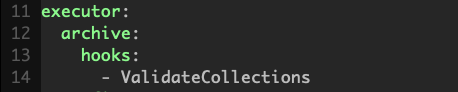

When debugging failed tests, it may be useful to examine the mongod data files that were archived after the failed test run. This page documents the process of archiving and things that may be worth considering when using archived data files.

# Configuring Resmoke to Archive Data Files
When resmoke executes a test, it only archives the data files for the mongod fixtures if the test fails and the test suite is configured to do so. Configuration for each suite can be found in `buildscripts/resmokeconfig/suites`. A suite can be configured to archive tests in the `archive` heading underneath the `executor` options. There are configuration options for hooks or js file tests, and either can be configured to archive for all tests or for individual test files. For example, the configuration of the [core](https://github.com/mongodb/mongo/blob/master/buildscripts/resmokeconfig/suites/core.yml) suite only archives data files when the `ValidateCollections` test hook fails: 

The [concurrency_replication suite](https://github.com/mongodb/mongo/blob/master/buildscripts/resmokeconfig/suites/concurrency_replication.yml), on the other hand, archives data files when there is a failure in the `CheckReplDBHashInBackround` hook, `ValidateCollectionsInBackground` hook, `CheckReplDBHash` hook, `ValidateCollections` hook, or **any js test**:

Note that `tests` may be a boolean or a list of tests.

# Using Archived Data Files
When data files are archived and stored to S3, they are kept for 180 days, and may be downloaded from the relevant Evergreen task page. If there is no data file listed, then either there was no test failure, the test wasn't configured to archive data files, or there was an error in archiving. (If the latter, please contact STM.) Example of a task with archived data files:

The data files are in a tarball and named after the failed test or hook that triggered archiving. After downloading and untarring, they can be used by starting a mongod with the dbpath set to the data file directory. Make sure the mongod version used is exactly the same as the version in the commit with a failed test; using a different version may cause invariants to fail at startup.  In most cases, just bringing up standalone mongod instances for each collected data file makes sense, because that allows the data files to be examined as they were at each node when the failure was recorded. If the original test used a replica set fixture, creating a local replica set may allow data to propagate between nodes and cause the data files to be changed from their state at failure time.

That said, if you do want to intialize a local replica set based on archived data files, make sure to use the same port and replica set name as in the original invocation (which can be seen in the logs). Otherwise, each node will enter the `REMOVED` state and will need to be reconfigured.

# Data Archival and Core Dumps
When resmoke detects that a test has failed, it dynamically generates a new `FixtureAbortTestCase` for immediate execution. This test case sends a `SIGABRT` to each running mongod. A `SIGABRT` is used instead of a `SIGKILL` in order to force the creation of a core dump. If a core dump exists, it will be visible alongside other archived data files in the task page. Users can tell whether the abort originates from inside the mongod or was sent by resmoke by determining whether an abort test case was created and examining its logs, or by examining the logs of the failed test case. A failure in the aborting, such as if the process isn't currently running (if it was already aborted, killed, etc), will be noted in the logs of the dynamically-generated test case, but will not result in a test failure.  Afterwards, resmoke executes a `FixtureSetupTestCase` so that further tests can be executed. Please keep in mind that some duration may pass between when a test failure is recorded and when the `SIGABRT` is sent to the mongods, and writes to disk may occur in this time, so it is possible that data files don't perfectly represent the state at test failure.

