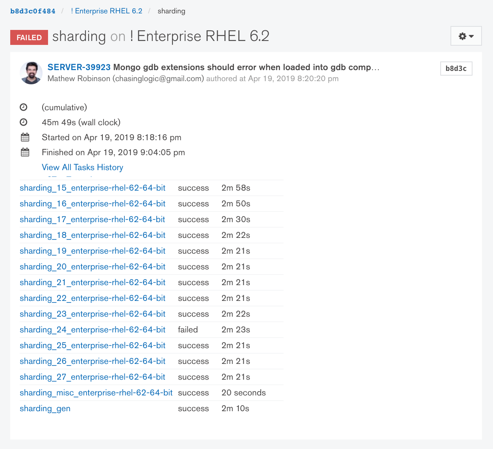
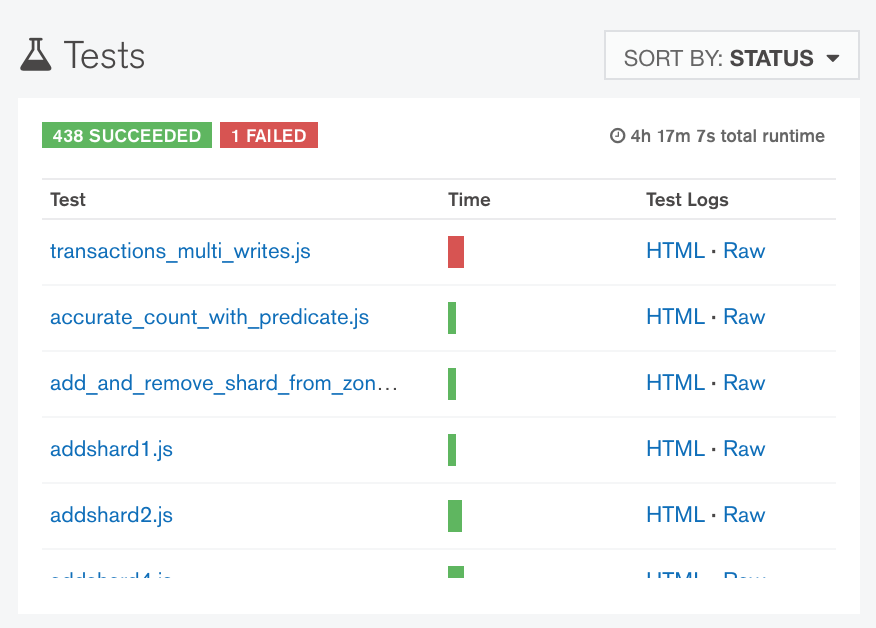
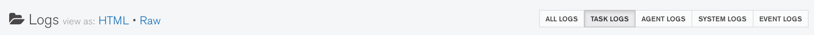
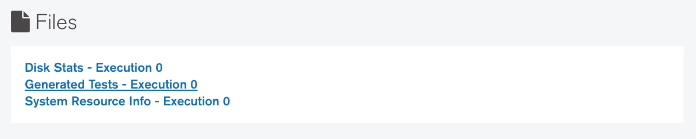

# Dissecting the Evergreen task page (terminology)

The _Evergreen task page_ (also commonly just referred to as the _task page_) shows (1) the overall
status of a test suite and (2) the individual pass/fail status for tests within the test suite. As a
result of the effort to have shorter Evergreen tasks which are able to be run in parallel on
separate machines, Evergreen added a notion of _display tasks_ which group the results of multiple
tasks together on the same task page. The tasks which comprise a display task are referred to as
_execution tasks_. An execution task is simply a task that actually ran on a machine.

Certain information about how a task ran on a machine is only present on the task page for the
execution task rather than the task page for the parent display task. More on this is covered below.



The _test results pane_ is present on both the task page for each execution task and for the parent
display task. It shows the individual pass/fail status for tests within the test suite, along with
links to https://logkeeper.mongodb.org containing the test output. The _test logs_ include any log
output from the test binary (e.g. the mongo shell for any JavaScript integration tests) and any log
output from the MongoDB cluster (if one is started by the test suite) from while the test was
running. The "HTML" links go to _Lobster_, a browser-based log viewer that works pretty well for
large amounts of log data. The "Raw" links are suitable for using `curl` or `wget` to download the
logs and then view them locally.



The task page for an execution task has links to the _task logs_ and—assuming you're logged in to
Evergreen—to the _system logs_ as well. The task logs contain the log output written to stdout or
stderr from any commands executed during the Evergreen task. For the purposes of trying to run a
test from an Evergreen task locally, we only need to concern ourselves with the log output from
resmoke.py.



# Building up the resmoke.py invocation

The task logs will contain a "resmoke.py invocation for local usage" log message which you can
copy-paste to run **the entire test suite** locally. For example:

```
[2019/04/19 21:01:34.375] [resmoke] 2019-04-19T21:01:34.374+0000 resmoke.py invocation for local usage: buildscripts/resmoke.py --suites=sharding --storageEngine=wiredTiger --continueOnFailure --jobs=16 --repeat=1 --shuffleMode=on --storageEngineCacheSizeGB=1
```

If you're only interested in running a single test from the test suite, then specify the path to the
test file after all of the arguments in the above invocation. **Protip**: Near the beginning of the
test logs will be a "Starting ..." message which contains the path to the test file relative to the
root of the mongodb/mongo repository.

```
[js_test:transactions_multi_writes] 2019-04-19T21:02:11.112+0000 Starting JSTest jstests/sharding/transactions_multi_writes.js...
```

Altogether it would look like

```
buildscripts/resmoke.py --suites=sharding --storageEngine=wiredTiger --continueOnFailure --jobs=16 --repeat=1 --shuffleMode=on --storageEngineCacheSizeGB=1 jstests/sharding/transactions_multi_writes.js
```

## For multi-version test suites

Note that if you're attempting to run a multi-version test suite (see below) then the
`/data/multiversion` directory must be on your `PATH`.

```
PATH=/data/multiversion:$PATH buildscripts/resmoke.py --suites=multiversion ...
```

**Protip**: Consider permanently adding the `/data/multiversion/` directory to your `PATH` by
updating your `.bashrc`, `.zshrc`, etc.

# Additional setup required

Some test suites require some additional setup before they can be run. The following sections are a
non-exhaustive selection of the most common test suites you may end up trying to run locally.
**Protip**: The source of truth for how any test suites which aren't covered here are run lives in
the `etc/evergreen.yml` project configuration file or in the "Generated Task Config" tarball
attached to any `_gen`-suffixed Evergreen task ([for example](https://evergreen.mongodb.com/task/mongodb_mongo_master_enterprise_rhel_62_64_bit_sharding_gen_b8d3c0f4845092c4a52844f05153f38035fd96aa_19_04_19_20_05_34/0)).

## Multi-version test suites

Multi-version test suites encompass anything which exercises upgrade/downgrade or mixed-version
MongoDB clusters. Logic for spawning an earlier version of MongoDB within a JavaScript test is built
into the mongo shell by searching for a `<executable name>-<version suffix>` file (e.g.
`mongod-4.0`) on the `PATH`. Tests which do so can most easily be identified by their usage of
`binVersion` as an argument to `MongoRunner`, `ReplSetTest`, `ShardingTest`, etc. Some examples of
Evergreen tasks that do this are listed below:

- aggregation_expression_multiversion_fuzzer
- aggregation_multiversion_fuzzer
- multiversion
- multiversion_auth
- sharding_last_stable_mongos_and_mixed_shards
- update_fuzzer
- update_fuzzer_replication

The `"do multiversion setup"` function defined in the `etc/evergreen.yml` project configuration file
is responsible for running the `buildscripts/setup_multiversion_mongodb.py` script. The arguments to
the `buildscripts/setup_multiversion_mongodb.py` script can be found in the task logs. You may need
to adjust the `--platform` and `--architecture` arguments in order to download binaries suitable for
your local environment.

```
[2019/04/23 20:25:52.106] rm -rf /data/install /data/multiversion
[2019/04/23 20:25:52.106] $python buildscripts/setup_multiversion_mongodb.py   \
[2019/04/23 20:25:52.106]   --installDir /data/install                         \
[2019/04/23 20:25:52.106]   --linkDir /data/multiversion                       \
[2019/04/23 20:25:52.107]   --edition enterprise             \
[2019/04/23 20:25:52.107]   --platform rhel62          \
[2019/04/23 20:25:52.107]   --architecture x86_64 \
[2019/04/23 20:25:52.107]   --useLatest 3.2 3.4 3.6 4.0 4.0.1 4.0.5
```

### macOS example

Use `--platform macos` (or `--platform osx` as appropriate) and `--architecture x86_64`.

```
mkdir -p /data/install /data/multiversion
rm -rf /data/install/* /data/multiversion/*
# Use `--platform osx` for versions earlier than MongoDB 4.2
python buildscripts/setup_multiversion_mongodb.py --installDir /data/install --linkDir /data/multiversion --edition enterprise --platform osx --architecture x86_64 --useLatest 3.2 3.4 3.6 4.0 4.0.1 4.0.5
# Use `--platform macos` for versions MongoDB 4.2 and later.
python buildscripts/setup_multiversion_mongodb.py --installDir /data/install --linkDir /data/multiversion --edition enterprise --platform macos --architecture x86_64 --useLatest 4.2
```

## Fuzzer test suites

Refer to [Wikipedia's article on fuzzing](https://en.wikipedia.org/wiki/Fuzzing) to learn more about
fuzz testing in general. MongoDB fuzzer test suites encompass anything which use the
[10gen/jstestfuzz](https://github.com/10gen/jstestfuzz) repository to randomly generate test files
that are later run by resmoke.py. All of Evergreen tasks that do this contain the word "fuzz" from
either "jstestfuzz" or "fuzzer" being in their name.

It **isn't** necessary to run the fuzzer locally to re-generate the generated test files. The
generated test files are uploaded to S3 and the "Generated Tests" link to download them can be found
in _the files section_ on the Evergreen task page.



The generated test files should be extracted into a top-level `jstestfuzz/` directory within the
mongodb/mongo repository.

```
mkdir -p jstestfuzz
rm -rf jstestfuzz/out/*
curl -s https://s3.amazonaws.com/mciuploads/... | tar -C jstestfuzz/ -zxv
```

The final layout should look like `jstestfuzz/out/<lots of .js files>`.

```
$ tree jstestfuzz/
jstestfuzz/
└── out
    ├── jstestfuzz-ba13-ent_acdd-qa_a6ce-1556051746371-0.js
    ├── jstestfuzz-ba13-ent_acdd-qa_a6ce-1556051746371-1.js
    ├── jstestfuzz-ba13-ent_acdd-qa_a6ce-1556051746371-2.js
    ├── jstestfuzz-ba13-ent_acdd-qa_a6ce-1556051746371-3.js
    ├── jstestfuzz-ba13-ent_acdd-qa_a6ce-1556051746371-4.js
    ├── jstestfuzz-ba13-ent_acdd-qa_a6ce-1556051746371-5.js
    ├── jstestfuzz-ba13-ent_acdd-qa_a6ce-1556051746371-6.js
    ├── jstestfuzz-ba13-ent_acdd-qa_a6ce-1556051746371-7.js
    ├── jstestfuzz-ba13-ent_acdd-qa_a6ce-1556051746371-8.js
    └── jstestfuzz-ba13-ent_acdd-qa_a6ce-1556051746371-9.js
```
